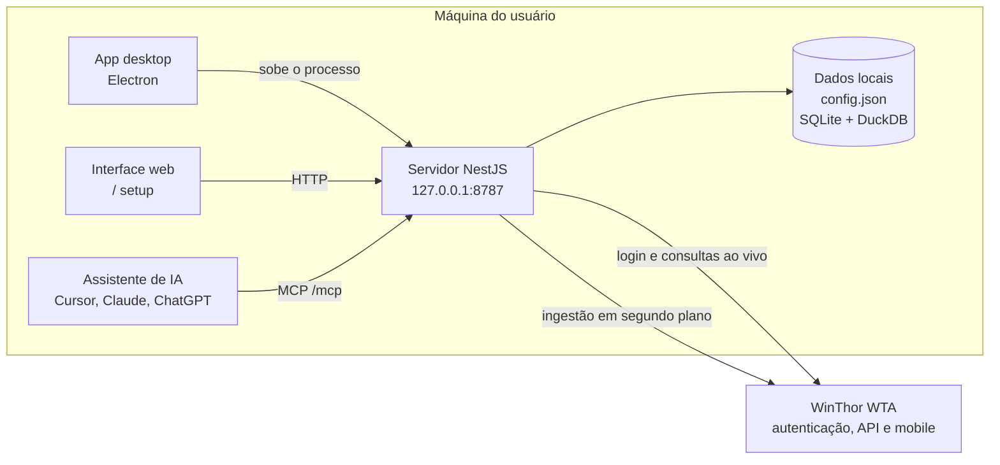
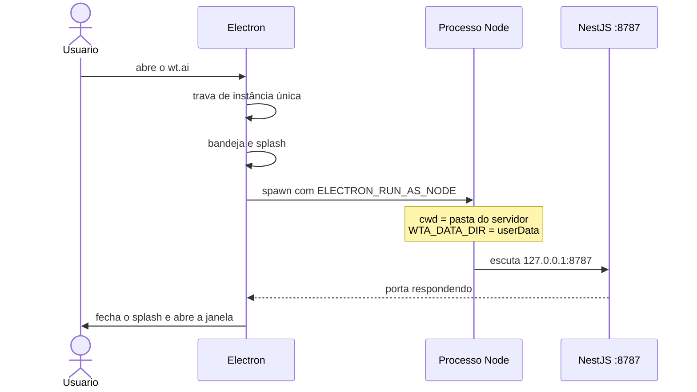
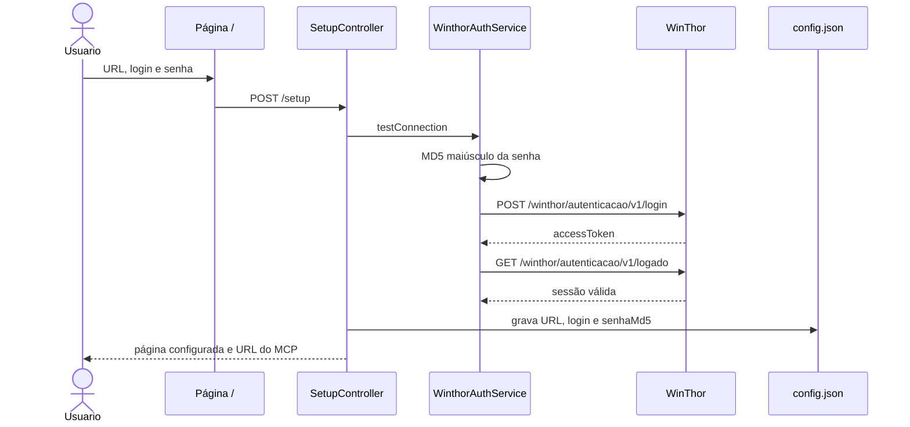
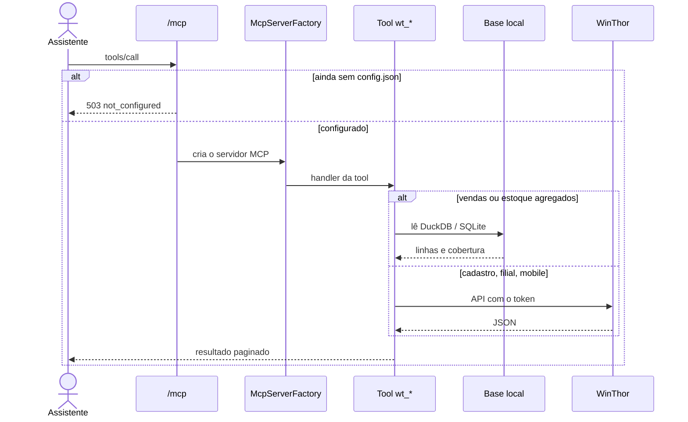
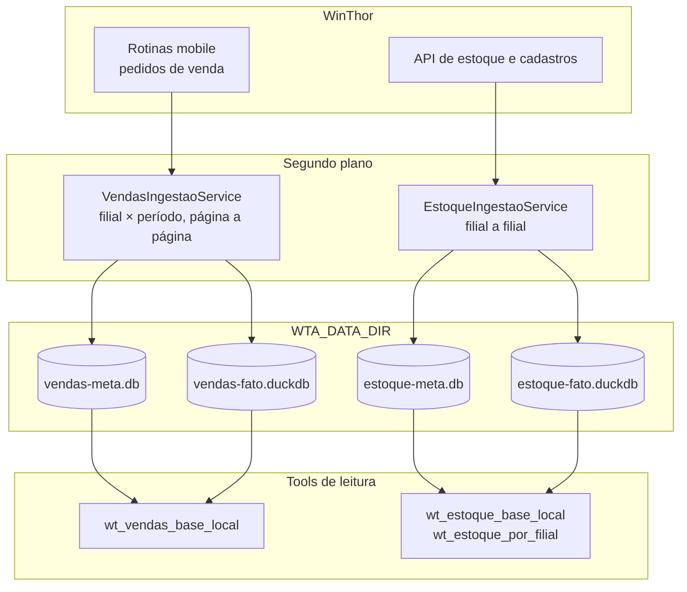
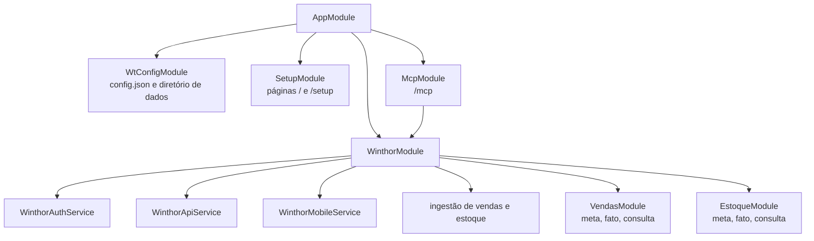

# Arquitetura

O aplicativo de desktop sobe o servidor na máquina do usuário; as credenciais ficam só nesse computador. Consultas pesadas de vendas e estoque leem uma base local; o restante vai direto à API do WinThor.

Há dois modos de uso. No dia a dia, o app Electron inicia o servidor, mostra a bandeja e abre a janela em `http://127.0.0.1:8787`. Em desenvolvimento, o servidor sobe sozinho com `npm run start:dev` dentro de `server/`.

## Visão geral

## Subida do aplicativo

Ao sair, o Electron manda o processo filho encerrar antes de fechar, para a porta 8787 não ficar presa. Uma segunda abertura do app só traz a janela que já existe.

No pacote instalado, o JavaScript do servidor viaja em `extraResources` e os dados vão para o `userData` do Electron. Em desenvolvimento, os arquivos ficam em `server/data/`.

## Configuração e login

A página inicial pede a URL base do WinThor, o login e a senha. A senha vira MD5 em maiúsculas, no padrão WTA, e o texto puro não é gravado.

Enquanto não houver `config.json` válido, `POST /mcp` responde `503`. A página configurada também grava o servidor `wt.ai` no arquivo de MCP do Cursor, Claude Desktop, Claude Code ou ChatGPT.

O token fica em memória. Ele é reutilizado por uma janela curta e renovado quando expira ou quando a URL ou o login mudam.

## Caminho de uma pergunta

O assistente fala JSON-RPC em `http://127.0.0.1:8787/mcp`. Cada chamada marca vendas e estoque como ocupados, para a ingestão em segundo plano esperar e não disputar o ERP com a pergunta.

`instalarPaginacao` envolve todas as tools e devolve um envelope com página, tamanho e continuação. O tamanho de página tem teto fixo para a resposta caber no contexto do modelo.

## Bases locais

Vendas e estoque seguem o mesmo desenho: metadados e cobertura em SQLite, fatos em DuckDB. A ingestão mora no módulo WinThor; a leitura mora nos módulos de vendas e estoque. Essa separação evita um ciclo no grafo do Nest.

A ingestão de vendas percorre o histórico (ano atual e anterior) e, em ciclos mais curtos, o mês atual e o anterior. Estoque refaz a fotografia por filial quando a cópia local passa da validade. As duas pausam enquanto uma tool MCP está em andamento.

Tools de sincronização (`wt_vendas_sincronizar`, `wt_estoque_sincronizar`) disparam o mesmo trabalho sob demanda e devolvem o progresso.

## Módulos do servidor

## Tools MCP

| Grupo | Tools | Origem dos dados |
| --- | --- | --- |
| Servidor | `wt_ping`, `wt_test_connection`, `wt_server_info` | processo local e login WTA |
| Cadastro | `wt_list_filiais`, `wt_buscar_clientes`, `wt_buscar_pedidos_venda` | API WinThor, com cache curto de filiais |
| Vendas | `wt_vendas_base_local`, `wt_vendas_sincronizar` | DuckDB e SQLite locais |
| Estoque | `wt_estoque_base_local`, `wt_estoque_por_filial`, `wt_estoque_sincronizar` | DuckDB, SQLite e, no detalhe, a API |
| Mobile | inadimplência, lucratividade, faturamento agregado e pesquisas auxiliares | rotinas mobile do WinThor |

Perguntas reais que essas tools atendem: [casos de uso](casos-de-uso.md).
